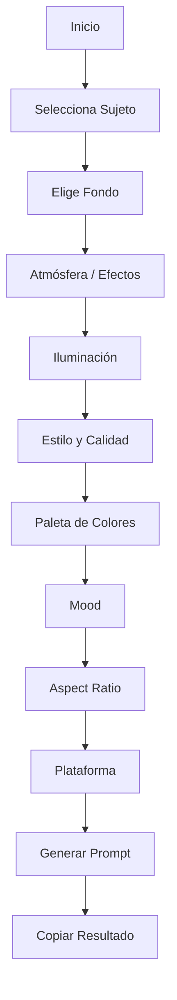

# 📸 GenPrompts


## 🌐 Web en vivo

<div align="center">
  <a href="https://jhormancastella.github.io/GenPrompts/" target="_blank">
    
  </a>
</div>

---

## 📖 Descripción

**GenPrompts** es una herramienta web interactiva diseñada para generar **prompts profesionales** de imágenes para inteligencia artificial. Permite construir escenas detalladas seleccionando opciones organizadas por categorías: sujeto, fondo, atmósfera, iluminación, estilo, colores y mood. Además, adapta el resultado a diferentes plataformas de generación de imágenes.

---

## ✨ Características principales

- **Generador por secciones** – Construye prompts paso a paso.
- **Modo Básico y Avanzado** – Elige entre opciones limitadas (5 por sección) o el catálogo completo.
- **Idioma bilingüe** – Alterna entre español e inglés con un clic.
- **Modo oscuro/claro** – Interfaz adaptable a preferencias visuales.
- **Copiado inteligente** – Copia el prompt y los términos negativos según la plataforma seleccionada.
- **UI rápida y responsive** – Funciona en dispositivos móviles y de escritorio.

---

## 🧭 Flujo de uso (interactivo)



---

🛠️ Tecnologías utilizadas

· HTML5 – Estructura semántica.
· CSS3 – Estilos, modo oscuro/claro, responsive.
· JavaScript (Vanilla) – Lógica de generación, manejo de datos y eventos.
· GitHub Pages – Alojamiento gratuito.

---

📂 Estructura del proyecto

```
GenPrompts/
├── index.html          # Página principal
├── style.css           # Estilos
├── app.js              # Lógica principal
├── data.js             # Datos de prompts (catálogo de opciones)
├── assets/             # Imágenes, iconos y recursos
├── robots.txt          # Configuración para buscadores
└── sitemap.xml         # Mapa del sitio
```

---

🚀 Uso local

Sigue estos pasos para ejecutar GenPrompts en tu máquina:

1. Clona el repositorio
   ```bash
   git clone https://github.com/jhormancastella/GenPrompts.git
   cd GenPrompts
   ```
2. Abre el proyecto
      Simplemente abre el archivo index.html en tu navegador favorito.
3. Explora y genera prompts
      Selecciona las opciones deseadas, elige la plataforma y copia el resultado.

⚠️ Nota: No requiere servidor backend ni instalación de dependencias.

---

🔍 SEO y accesibilidad

· Metatags básicos en index.html para mejorar la visibilidad.
· robots.txt y sitemap.xml configurados para motores de búsqueda.
· Estructura semántica HTML5.
· Contraste y navegación por teclado considerados.

---

🤝 Contribuciones

Las contribuciones son bienvenidas. Si deseas mejorar el proyecto:

1. Haz un fork del repositorio.
2. Crea una rama con tu nueva funcionalidad (git checkout -b feature/nueva-funcionalidad).
3. Realiza tus cambios y haz commit (git commit -m 'Añade nueva funcionalidad').
4. Sube los cambios (git push origin feature/nueva-funcionalidad).
5. Abre un Pull Request.

Por favor, asegúrate de que tu código sigue el estilo general y de que no introduces errores.

---

📄 Licencia

Este proyecto se distribuye bajo la licencia MIT. Consulta el archivo LICENSE para más detalles.

---

📬 Contacto

Si tienes preguntas o sugerencias, no dudes en abrir un issue en el repositorio o contactar al autor.

---

© 2026 GenPrompts – Hecho con ❤️ para la comunidad de IA generativa.

```
