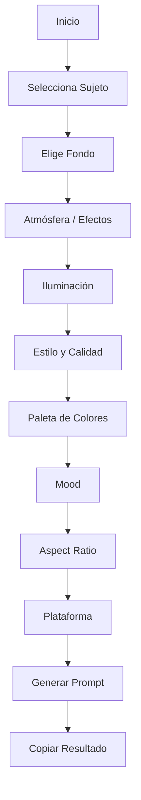

# 📸 GPROMTS

## web

Explóralo y dime qué te parece.

## 🌟 Descripción breve
GPROMTS es una herramienta web para generar prompts profesionales de imágenes con IA. Permite construir escenas completas con sujeto, fondo, atmósfera, iluminación, estilo, color y mood, adaptando el resultado a distintas plataformas.

## ✅ Características principales
- Generador de prompts por secciones.
- Modo Básico (5 opciones por sección) y Avanzado (catálogo completo).
- Selector de idioma ES/EN.
- Modo oscuro y modo claro.
- Copiar prompt y negativos según plataforma.
- UI rápida y responsive.

## 🧭 Mapa de flujo (interactivo)

## 🧪 Tecnologías usadas
- HTML5
- CSS3
- JavaScript (vanilla)

## 📁 Estructura del proyecto
- `index.html`
- `style.css`
- `app.js`
- `data.js`
- `assets/`
- `robots.txt`
- `sitemap.xml`

## 🚀 Uso local
1. Abrir `index.html` en el navegador.
2. Seleccionar opciones y generar el prompt.

## 🔎 SEO
- Meta tags básicos en `index.html`.
- `robots.txt` y `sitemap.xml` incluidos.

## 🧾 Notas
- Actualiza el enlace en la sección **web** con tu URL real.
- Si quieres traducción completa de opciones, traduce `data.js`.

---
© 2026 GPROMTS
